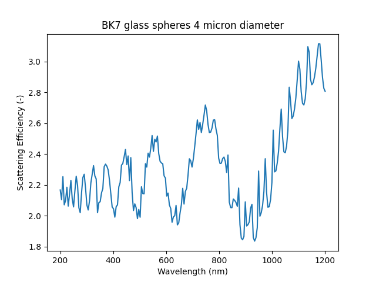
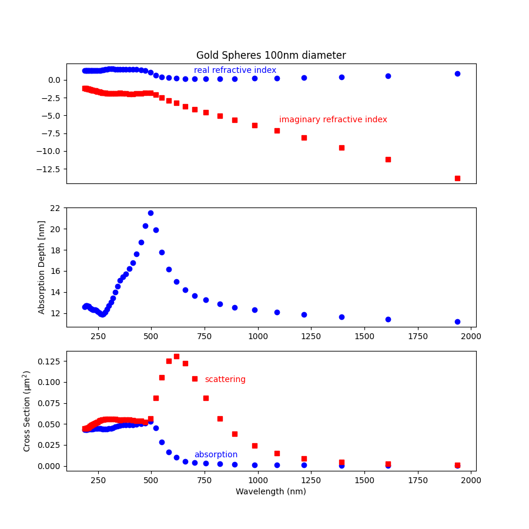

miepython
=========

.. image:: https://colab.research.google.com/assets/colab-badge.svg
   :target: https://colab.research.google.com/github/scottprahl/miepython/blob/master

.. image:: https://img.shields.io/badge/readthedocs-latest-blue.svg
   :target: https://miepython.readthedocs.io

.. image:: https://img.shields.io/badge/github-code-green.svg
   :target: https://github.com/scottprahl/miepython

.. image:: https://img.shields.io/badge/MIT-license-yellow.svg
   :target: https://github.com/scottprahl/miepython/blob/master/LICENSE.txt

----

``miepython`` is a pure Python module to calculate light scattering by
non-absorbing, partially-absorbing, or perfectly conducting spheres. Mie
theory is used, following `the procedure described by Wiscombe
<http://opensky.ucar.edu/islandora/object/technotes:232>`_. This code has
been validated against his results. 

This code provides functions for calculating the extinction efficiency,
scattering efficiency, backscattering, and scattering asymmetry.
Moreover, a set of angles can be given to calculate the scattering at various
angles for a sphere.

Heads up!
---------
When comparing different Mie scattering codes, make sure that you're
aware of the conventions used by each code.  ``miepython`` makes the
following assumptions

* the imaginary part of the complex index of refraction for absorbing spheres is *negative*.

* the scattering phase function is normalized so it equals the *single scattering albedo* when integrated over 4π steradians.

Using miepython
---------------

1. You can install locally using pip::
    
    pip install --user miepython

2. or `run this code in the cloud using Google Collaboratory <https://colab.research.google.com/github/scottprahl/miepython/blob/master>`_ by selecting the Jupyter notebook that interests you.

Script Examples for those that don't do Jupyter
-----------------------------------------------

Simple Dielectric
^^^^^^^^^^^^^^^^^

.. literalinclude:: ../miepython/examples/01_dielectric.py
.. image:: 01_plot.png

Glass Spheres
^^^^^^^^^^^^^

.. literalinclude:: ../miepython/examples/02_glass.py

Water Droplets
^^^^^^^^^^^^^^

.. literalinclude:: ../miepython/examples/03_droplets.py
.. image:: 03_plot.png

Small Gold Spheres
^^^^^^^^^^^^^^^^^^

.. literalinclude:: ../miepython/examples/04_gold.py

.. toctree::
   :maxdepth: 2

.. toctree::
   :caption: Example Usage
   :hidden:

   01_basics.ipynb
   02_efficiencies.ipynb
   03_angular_scattering.ipynb
   05_fog.ipynb

.. toctree::
   :caption: Comparisons and Tests
   :hidden:

   08_large_spheres.ipynb
   04_rayleigh.ipynb
   09_backscattering.ipynb
   10_basic_tests.ipynb

.. toctree::
   :caption: Algorithm Details
   :hidden:

   07_algorithm.ipynb
   06_random_deviates.ipynb

.. toctree::
   :caption: Numba (jit) Performance
   :hidden:

   11_performance.ipynb

.. toctree::
   :caption: API
   :hidden:

   miepython
   miepython_nojit

.. toctree::
   :caption: Versions
   :hidden:

   changelog
